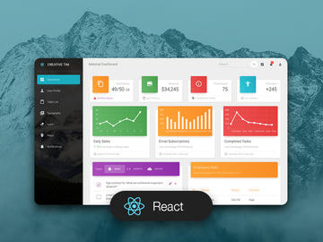

# German Cheat-Sheet

*Currently in development*

## To do
- Finish tables
- Set picklist input types for list categories
- Migrate db to heroku
- Push latest api changes to heroku
- Connect front end to heroku api
- Customize styles

## Description

German Cheat-Sheet is an educational aid for German learners. It includes standard tables for laying out grammatical concepts clearly, as well as dynamic lists that learners can edit as they wish.

It was built with [Creative Tim](https://www.creative-tim.com)'s [Material Dashboard React](https://www.creative-tim.com/product/material-dashboard-react) template.

[](https://www.creative-tim.com/product/material-dashboard-react)

## Quick start

1. Clone the repo: `git clone https://github.com/mgbarois/german-cheat-sheet.git`.
2. `npm install` to install modules.


## Dictionary translation feature

You will need to request a free API key from Rapid API to use the Dictionary translation feature.

## Documentation & Resources
[Material Dashboard React | Documenation](https://demos.creative-tim.com/material-dashboard-react/#/documentation/tutorial).
[Material UI Core | Documentation](https://material-ui.com/components)
[Material UI | Icons](https://material-ui.com/components/material-icons/)
[Reactstrap | Components](https://reactstrap.github.io/components/alerts/)

## File Structure

Within the download you'll find the following directories and files:

```
material-dashboard-react
.
├── CHANGELOG.md
├── ISSUE_TEMPLATE.md
├── LICENSE.md
├── README.md
├── bower.json
├── gulpfile.js
├── jsconfig.json
├── package.json
├── documentation
│   ├── assets
│   │   ├── css
│   │   ├── img
│   │   │   └── faces
│   │   └── js
│   └── tutorial-components.html
├── public
│   ├── favicon.ico
│   ├── index.html
│   └── manifest.json
└── src
    ├── index.js
    ├── logo.svg
    ├── routes.js
    ├── assets
    │   ├── css
    │   │   └── material-dashboard-react.css
    │   ├── github
    │   │   ├── md-react.gif
    │   │   └── react.svg
    │   ├── img
    │   │   └── faces
    │   └── jss
    │       ├── material-dashboard-react
    │       │   ├── components
    │       │   ├── layouts
    │       │   └── views
    │       └── material-dashboard-react.js
    ├── components
    │   ├── Card
    │   │   ├── Card.js
    │   │   ├── CardAvatar.js
    │   │   ├── CardBody.js
    │   │   ├── CardFooter.js
    │   │   ├── CardHeader.js
    │   │   └── CardIcon.js
    │   ├── CustomButtons
    │   │   └── Button.js
    │   ├── CustomInput
    │   │   └── CustomInput.js
    │   ├── CustomTabs
    │   │   └── CustomTabs.js
    │   ├── FixedPlugin
    │   │   └── FixedPlugin.js
    │   ├── Footer
    │   │   └── Footer.js
    │   ├── Grid
    │   │   ├── GridContainer.js
    │   │   └── GridItem.js
    │   ├── Navbars
    │   │   ├── AdminNavbarLinks.js
    │   │   ├── Navbar.js
    │   │   └── RTLNavbarLinks.js
    │   ├── Sidebar
    │   │   └── Sidebar.js
    │   ├── Snackbar
    │   │   ├── Snackbar.js
    │   │   └── SnackbarContent.js
    │   ├── Table
    │   │   └── Table.js
    │   ├── Tasks
    │   │   └── Tasks.js
    │   └── Typography
    │       ├── Danger.js
    │       ├── Info.js
    │       ├── Muted.js
    │       ├── Primary.js
    │       ├── Quote.js
    │       ├── Success.js
    │       └── Warning.js
    ├── layouts
    │   ├── Admin.js
    │   └── RTL.js
    ├── variables
    │   ├── charts.js
    │   └── general.js
    └── views
        ├── Dashboard
        │   └── Dashboard.js
        ├── Icons
        │   └── Icons.js
        ├── Maps
        │   └── Maps.js
        ├── Notifications
        │   └── Notifications.js
        ├── RTLPage
        │   └── RTLPage.js
        ├── TableList
        │   └── TableList.js
        ├── Typography
        │   └── Typography.js
        ├── UpgradeToPro
        │   └── UpgradeToPro.js
        └── UserProfile
            └── UserProfile.js
```

## Browser Support

## Resources
- Demo: https://demos.creative-tim.com/material-dashboard-react
- Download Page: https://www.creative-tim.com/product/material-dashboard-react
- Documentation: https://demos.creative-tim.com/material-dashboard-react/#/documentation/tutorial
- License Agreement: https://www.creative-tim.com/license
- Support: https://www.creative-tim.com/contact-us
- Issues: [Github Issues Page](https://github.com/creativetimofficial/material-dashboard-react/issues)
- [Material Kit React - For Front End Development](https://www.creative-tim.com/product/material-kit-react?ref=github-mdr-free)